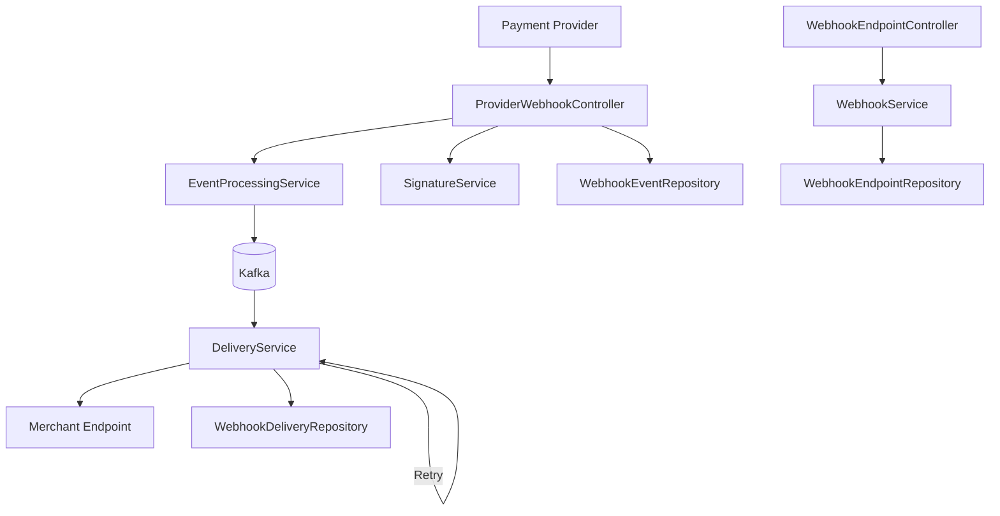

# Payment Service Webhook

A robust, scalable webhook service for processing payment events from external providers.

[](https://www.oracle.com/java/technologies/javase-jdk17-downloads.html)
[](https://spring.io/projects/spring-boot)
[](https://github.com/dammyadekoya/payment-service-webhook/blob/main/LICENSE)

## Table of Contents

- [Overview](#overview)
- [Features](#features)
- [Architecture](#architecture)
- [Tech Stack](#tech-stack)
- [Prerequisites](#prerequisites)
- [Getting Started](#getting-started)
  - [Local Development](#local-development)
  - [Docker Setup](#docker-setup)
- [API Documentation](#api-documentation)
- [Database Schema](#database-schema)
- [Configuration](#configuration)
- [Testing](#testing)
- [Deployment](#deployment)
- [Monitoring](#monitoring)
- [Contributing](#contributing)
- [License](#license)

## Overview

The Payment Service Webhook is a backend service designed to manage and process webhook events from external payment providers. It enables secure, reliable, and asynchronous communication between payment systems and merchants by delivering event notifications (e.g., payment success, refund, etc.) to registered endpoints.

## Features

- **Secure Webhook Reception**: Accepts and validates webhook events from payment providers (Stripe, PayPal, Razorpay)
- **Signature Verification**: Ensures authenticity of incoming webhook events
- **Idempotency Handling**: Prevents duplicate event processing
- **Reliable Delivery**: Guaranteed delivery of events to merchant endpoints with retry mechanisms
- **Asynchronous Processing**: Non-blocking event processing using Kafka
- **Circuit Breaker**: Fault tolerance with Resilience4j to avoid cascading failures
- **Rate Limiting**: Protection against excessive requests
- **Authentication & Authorization**: JWT-based security for endpoint protection
- **Monitoring & Observability**: Prometheus metrics and health checks via Spring Actuator
- **API Documentation**: Interactive API documentation with Swagger UI

## Architecture

The system follows a **modular monolith** architecture built on **Spring Boot**, with clear separation of concerns using domain-driven design (DDD) principles. It integrates event-driven components via **Kafka** and uses **asynchronous processing** for scalability.



### Key Components

1. **ProviderWebhookController**: Handles incoming webhook events from payment providers
2. **WebhookEndpointController**: Manages merchant webhook endpoints (CRUD operations)
3. **EventProcessingService**: Processes incoming events and publishes to Kafka
4. **DeliveryService**: Sends HTTP requests to merchant endpoints
5. **SignatureService**: Validates webhook payloads for authenticity
6. **RetryService**: Manages retry logic with exponential backoff
7. **WebhookService**: Orchestrates webhook endpoint management

## Tech Stack

- **Java 17**: Primary programming language
- **Spring Boot 3.5.5**: Framework for building the web application
- **Spring Data JPA**: ORM for database operations
- **Spring Security**: Authentication and authorization
- **Spring Kafka**: Kafka integration for event streaming
- **PostgreSQL**: Primary relational database
- **Redis**: Caching and deduplication
- **Flyway 11.11.2**: Database migration tool
- **MapStruct**: DTO to entity mapping
- **Lombok**: Boilerplate code reduction
- **Resilience4j**: Circuit breaker and retry mechanisms
- **JWT**: Token-based authentication
- **OpenAPI (Swagger)**: API documentation
- **Micrometer + Prometheus**: Application monitoring
- **Docker**: Containerization
- **Maven**: Build tool
- **JUnit 5**: Testing framework
- **Testcontainers**: Integration testing with real dependencies

## Prerequisites

- Java 17 JDK
- Maven 3.6+
- Docker (for containerization and dependencies)
- PostgreSQL 15
- Redis 7
- Apache Kafka (Confluent Platform 7.5.0)

## Getting Started

### Local Development

1. Clone the repository:
   ```bash
   git clone https://github.com/dammyadekoya/payment-service-webhook.git
   cd payment-service-webhook
   ```

2. Set up the required services using Docker Compose:
   ```bash
   docker-compose up -d postgres redis zookeeper kafka
   ```

3. Create the database:
   ```bash
   # Connect to PostgreSQL and create the database
   docker exec -it payment-service-webhook-postgres-1 psql -U DAMMAK -c "CREATE DATABASE payment_webhook_db;"
   ```

4. Build the application:
   ```bash
   ./mvnw clean install
   ```

5. Run the application:
   ```bash
   ./mvnw spring-boot:run
   ```

The application will start on port 8080.

### Docker Setup

1. Build the Docker image:
   ```bash
   docker build -t payment-service-webhook .
   ```

2. Run all services using Docker Compose:
   ```bash
   docker-compose up -d
   ```

The application will be available at http://localhost:8080

## API Documentation

Interactive API documentation is available via Swagger UI:

- **Swagger UI**: http://localhost:8080/swagger-ui.html
- **API Docs**: http://localhost:8080/v3/api-docs

### Core Endpoints

1. **Provider Webhooks** (`/api/v1/webhooks/providers/{provider}/events`)
   - POST: Receive webhook events from payment providers

2. **Webhook Endpoints** (`/api/v1/webhooks/endpoints`)
   - POST: Create a new webhook endpoint
   - GET: List webhook endpoints
   - GET `/{id}`: Get a specific webhook endpoint
   - PUT `/{id}`: Update a webhook endpoint
   - DELETE `/{id}`: Delete a webhook endpoint
   - POST `/{id}/test`: Test a webhook endpoint

All merchant endpoints require authentication with a valid JWT token and the `X-Merchant-Id` header.

## Database Schema

The service uses PostgreSQL with the following core tables:

- **merchants**: Merchant information and credentials
- **webhook_endpoints**: Configured webhook endpoints for merchants
- **webhook_events**: Received webhook events from payment providers
- **webhook_deliveries**: Delivery attempts to merchant endpoints
- **event_subscriptions**: Event type subscriptions for endpoints
- **merchant_ip_whitelist**: IP whitelist for merchant security


## Configuration

The application is configured through `application.yml` and environment variables:

### Key Configuration Properties

| Property | Description | Default Value |
|----------|-------------|---------------|
| `spring.datasource.url` | PostgreSQL database URL | `jdbc:postgresql://localhost:5432/webhook_db` |
| `spring.redis.host` | Redis host | `localhost` |
| `spring.kafka.bootstrap-servers` | Kafka bootstrap servers | `localhost:9092` |
| `webhook.retry.max-attempts` | Maximum delivery retry attempts | `3` |
| `webhook.delivery.timeout` | HTTP delivery timeout (ms) | `30000` |

For a complete list of configuration options, see [application.yml](src/main/resources/application.yml).

## Testing

The project includes comprehensive unit and integration tests:

```bash
# Run all tests
./mvnw test

# Run tests with coverage
./mvnw test jacoco:report
```

### Test Structure

- **Unit Tests**: Service and component level tests
- **Integration Tests**: Full API endpoint testing
- **Repository Tests**: Database interaction tests
- **Mapper Tests**: DTO to entity mapping validation

Tests use:
- H2 in-memory database for repository tests
- Testcontainers for integration tests with real dependencies
- Mockito for mocking external services

## Deployment

### Docker Deployment

```bash
# Build the image
docker build -t payment-service-webhook .

# Run with dependencies
docker-compose up -d
```

### Kubernetes Deployment

The project includes Kubernetes manifests in the [k8s](k8s/) directory:

```bash
# Apply the manifests
kubectl apply -f k8s/
```

### Environment-Specific Configuration

The application supports environment-specific configurations:
- `application.yml`: Default configuration
- `application-docker.yml`: Docker-specific overrides
- `application-kubernetes.yml`: Kubernetes-specific overrides

## Monitoring

The application exposes several endpoints for monitoring:

- **Health**: http://localhost:8080/actuator/health
- **Metrics**: http://localhost:8080/actuator/metrics
- **Prometheus**: http://localhost:8080/actuator/prometheus

Key metrics include:
- HTTP request latency
- Database query performance
- Kafka processing metrics
- Webhook delivery success/failure rates

## Contributing

1. Fork the repository
2. Create a feature branch (`git checkout -b feature/AmazingFeature`)
3. Commit your changes (`git commit -m 'Add some AmazingFeature'`)
4. Push to the branch (`git push origin feature/AmazingFeature`)
5. Open a Pull Request

Please ensure your code follows the project's coding standards and includes appropriate tests.

## License

This project is licensed under the Apache License 2.0 - see the [LICENSE](LICENSE) file for details.

---

Developed with ❤️ by [Damola Adekoya](mailto:adekoyafelix@gmail.com)